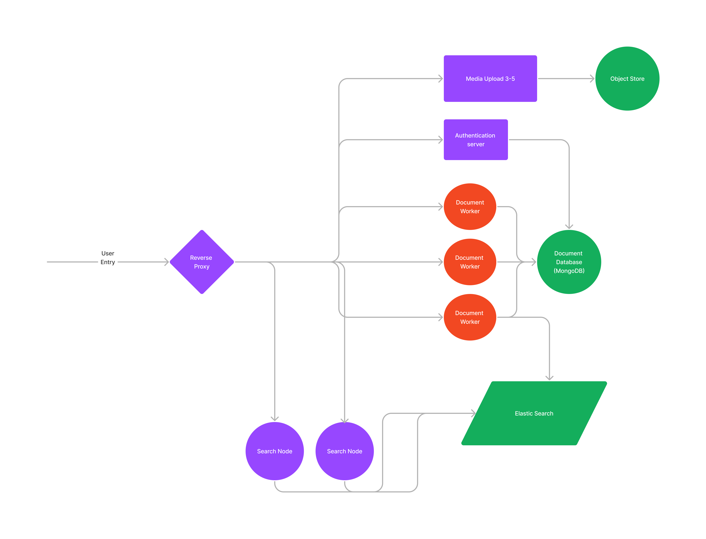

# OurDocs
Collaborative real time document editor built with yjs.

This was made as a final project for my Cloud Computing course.

I used various cloud practices, such as load balancing, reverse proxying, microservices, 
caching, and queueing to scale it to support 2300 RPS for writes and searches.

